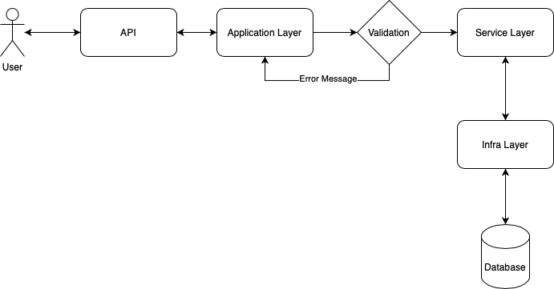

# Hotel Reservation :ticket:
 
Application responsible to manage hotel reservations
 
## Table of Contents
 
-  [API :ticket:](#api-ticket)
 
-  [Table of Contents](#table-of-contents)
 
-  [Features :rocket:](#features-rocket)
 
-  [API - Endpoints :satellite:](#api---endpoints-satellite)
 
-  [Requirements :wrench:](#requirements-wrench)
 
-  [Installation :gear:](#installation-gear)
 
-  [Usage :building_construction:](#usage-building_construction)
 
-  [Architecture :triangular_ruler:](#architecture-triangular_ruler)
 
-  [Support :construction_worker:](#support-construction_worker)
 
-  [Developers](#developers)
 
  
 
## Features :rocket:
 
-  __Get the Rooms:__ Retrieves the rooms, available and non-available
 
-  __Create a Reserve:__ User creates a reserve
 
-  __Cancel a Reserve:__ User cancels a reserve
 
-  __Modify a Reserve:__ User modifies a reserve
 
-  __Gets a Reserve:__ User retrieves a reserve
 
-  __Logs:__ The application is prepared to save logs in case of failure.
 
-  __Open API:__ Using Swagger for API versioning and specification
  
 
## API - Endpoints :satellite:
 
- GET /HotelRoom: Retrives a list of rooms
- GET /HotemReservation: Retrieves the Reservation based in the `Id` 
- POST /HotemReservation: Creates a new Reservation
- PATCH /HotemReservation: Updates a Reservation 
- DELETE /HotemReservation: Cancels a Reservation
  
PS: For more information about the endpoints, please execute the application and access the url `http://localhost:5000/swagger`
 
## Requirements :wrench:
 
- Visual Studio 2019 ([download](https://visualstudio.microsoft.com/thank-you-downloading-visual-studio/?sku=Community&rel=16))
 
- Git ([download](https://git-scm.com/downloads))
 
- NET 5 ([download](https://dotnet.microsoft.com/download/))
 
- Postman ([download](https://dl.pstmn.io/download/latest/win64))
 
- SQL Server Management Studio ([download](https://go.microsoft.com/fwlink/?linkid=2168063&clcid=0x409))
 
  
## Installation :gear:
 
Open the cmd and execute: ```git clone https://github.com/wbail/hotel-reservation```
 
## Usage :building_construction:
  
1. Open the Visual Studio 2019
2. Open the solution
3. Execute the application
4. Open Postman and import the collection `Hotel.postman_collection.json` and the environment `Hotel - Dev.postman_environment.json`. See the video tutorial inside the Postman folder.
5. When the application starts, the application seeds the database with data.
 
## Architecture :triangular_ruler:
 
 
 
## Support :construction_worker:
 
In case of features or bugs, please contact me or open a PR 
 
### Developer(s)
 
- Guilherme Bail ([email](mailto:guilhermedanbail@gmail.com), [github](https://github.com/wbail))